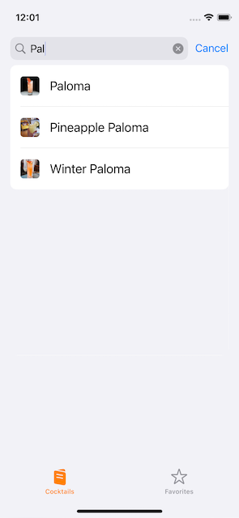
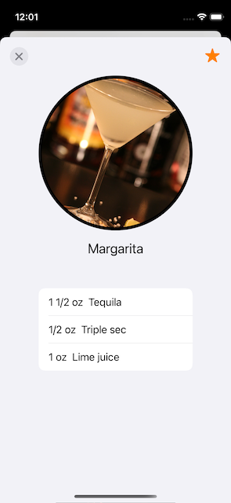

# RxCocktail 

## Description: 
App to browse cocktails by alcohol ingredient. Cocktail data provided by [TheCocktailDB](https://www.thecocktaildb.com)
Features a search bar to quickly find a cocktail and a detail page with all the ingredients needed.

### Built with:
- [RxSwift](https://github.com/ReactiveX/RxSwift)
- [Alamofire](https://github.com/Alamofire/Alamofire)
- [SDWebImage](https://github.com/SDWebImage/SDWebImage)
- MVVM
- UIKit
- Programmatic UI
- iOS 14+ Cell Content Configuration

**TODO:** 
- [ ] CoreData for local storage
- [ ] Favorites Tab
- [ ] Disconnected error
- [ ] Random cocktail widget